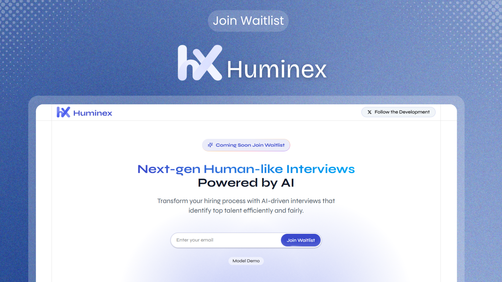

# Huminex - Uniting Talent & Opportunity with AI

[🌐 Visit Huminex Website](https://www.huminex.co/)

## 🚀 Overview

Huminex is a cutting-edge recruiting platform that leverages AI to revolutionize the hiring process. By combining intelligent candidate matching, AI-powered interviews, and advanced analytics, Huminex streamlines recruitment while ensuring fair and efficient talent acquisition.

## ✨ Key Features

### 🤖 AI-Powered Interviews

- Natural, adaptive conversations that feel genuinely human
- Intelligent performance analysis and feedback
- Bias-free evaluation system
- Support for video and audio interviews

### 📊 Smart Candidate Management

- AI-driven resume parsing and profile creation
- Intelligent candidate-job matching
- Comprehensive candidate evaluation metrics
- Centralized candidate database

### 📈 Advanced Analytics

- Detailed interview insights and performance metrics
- Time and cost reduction tracking
- Interview quality assessment
- Detailed reporting

### 🎯 For Employers

- Create and manage job postings effortlessly
- Streamline candidate screening
- Reduce time-to-hire by up to 75%
- Cut recruitment costs by 60%
- Access to a growing talent pool

### 🎓 For Candidates

- User-friendly interview experience
- Fair and consistent evaluation
- Instant feedback on performance
- Showcase skills through interactive assessments

## 🏆 Why Choose Huminex?

- **98% Interview Quality** - Industry-leading interview experience
- **100+ Active Interviews** - Growing community of top talent
- **75% Time Saved** - Streamlined hiring process
- **60% Cost Reduction** - Lower recruitment expenses
